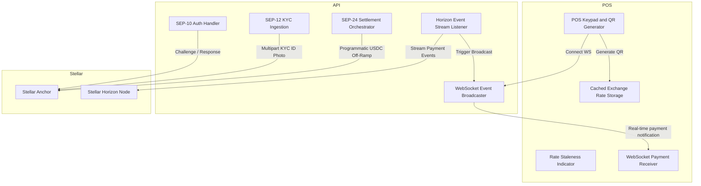

# Technical Reference

The HaloPay infrastructure separates the presentation layer from the settlement logic. The frontend point-of-sale application handles all user interactions and offline cryptographic payload generation. The backend API manages state synchronization, identity verification, and communication with the Stellar blockchain. 

## Component Interactions

The frontend client relies on `exchange-rate.ts` to query `localStorage` for recent rate data. The `StalenessIndicator` evaluates this timestamp against the system clock to update the UI. The `qr-generator.ts` module then constructs the final SEP-0007 string using the calculated crypto amount and the merchant's public key. 

The backend relies on `auth.routes.ts` and `sep10.service.ts` to manage handshake challenges and verify cryptographic signatures. Real-time notifications run through `horizon.service.ts`, which filters the Stellar Horizon firehose for merchant transactions. It passes these events to `websocket.service.ts`, which broadcasts JSON payloads to connected clients, triggering haptic success alerts in the POS interface.
