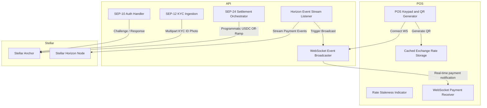

# Technical Reference

The HaloPay system architecture consists of a frontend POS, a backend API, and Stellar ecosystem services.

## Smart Contracts and APIs
HaloPay calls the Anchor API to initiate SEP-24 deposits and withdrawals. 
When a payment event arrives from Horizon, the `HorizonListener` verifies the transaction hash. It then alerts the `WSServer` to push a success message to the POS client.

See the [Protocol Mechanics](/protocol-mechanics) page for standard interactions.
